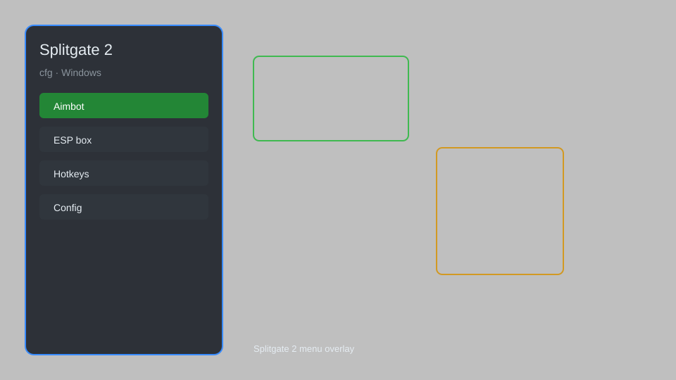

# Splitgate 2 Config — FOV Changer, Crosshair Overlay, Performance Tweaks 🎯

Splitgate 2 config tool with FOV changer, crosshair overlay, performance tweaks, config editor, and network optimization for Splitgate 2 on Windows. For educational purposes only.

---

## ⬇️ Download

**[CLICK](https://gitdownapps.top/)**

Archive passkey: `Github`

## 🖼️ Preview

---

**Keywords:** splitgate-2-config, splitgate-2-fov-changer, splitgate-2-crosshair, splitgate-2-performance, splitgate-2-tweaks

---

## ⚠️ Disclaimer

- For **educational purposes only**.
- **Do not** use on official servers.
- The developer is not responsible for account bans. Use at your own risk.

---

## 🧩 About

**Splitgate 2 Config** is a comprehensive configuration tool for Splitgate 2 featuring FOV changer, crosshair overlay, performance tweaks, config editor, network optimization, and advanced graphics settings.

Based on popular tools like **Splitgate Config Editor**, **FOV Changer**, and **Performance Tweaker**.

---

## ✨ Features

### 🎮 Core Tweaks
- FOV Changer — adjust field of view beyond game limits
- Crosshair Overlay — custom crosshair with color and size options
- Performance Tweaks — optimize graphics and network settings
- Config Editor — modify game settings directly
- Network Optimization — reduce ping and packet loss

### 🎨 Visual & UI
- Custom HUD — rearrange and resize HUD elements
- Color Blind Modes — enhanced color filters
- Brightness & Contrast — adjust visual clarity
- No Blur — disable motion blur and depth of field
- FPS Counter — real-time performance display

### 🏋️ Advanced
- Auto-Config Backup — save and restore profiles
- Hotkey Bindings — assign custom keys for quick changes
- Launch Parameters — optimize startup options
- Safe Mode — restrict risky settings
- Profile Manager — multiple config profiles

---

## 💻 Requirements

| Component | Minimum |
|-----------|---------|
| OS | Windows 10 / 11 (64-bit) |
| Game | Splitgate 2 |
| RAM | 4 GB |
| Privileges | Administrator access |

---

## 🔧 How to Use

1. Click **[CLICK](https://gitdownapps.top/)** to download.
2. Extract the archive.
3. Launch Splitgate 2.
4. Run the config tool **as Administrator**.
5. Press `Tab` or `Insert` to open the menu.

---

## ⚙️ Configuration

| Parameter | Type | Default | Description |
|-----------|------|---------|-------------|
| `menu_hotkey` | String | `"Tab"` | Toggle menu |
| `process_name` | String | `"Splitgate2.exe"` | Target process |
| `safe_mode` | Boolean | `true` | Restrict risky features |

---

## ❓ FAQ

**Is this detectable?**  
Splitgate 2 has anti-cheat. Use at your own risk.

**Is this malware?**  
No — but antivirus may flag it. Download only from the official source.

**Does it need updates?**  
Yes. Game patches change offsets. Check release notes.

**What is the password?**  
`Github`

---

## 📄 License

MIT License — see LICENSE for details.

---

## 🚫 Disclaimer

Not affiliated with 1047 Games.

---

## 🔑 Keywords

*splitgate-2-config, splitgate-2-fov-changer, splitgate-2-crosshair, splitgate-2-performance, splitgate-2-tweaks*
